 <h1>Picker 3D Zynga Clone via Unity</h1>

 
Click, Watch the video

 

 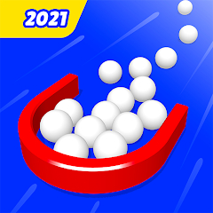</a>
  

### Hello, I'm Turgay. I am studying computer engineering in Turkey. I will graduate in about a month. This project is my first step towards becoming a game developer.

  

 ### I completed this project in 1 week for the technical interview of Level-UP Bootcamp. Therefore, it may contain visual differences and missing levels from the original.

 
<h2>Gameplay Screenshot</h2>
 

 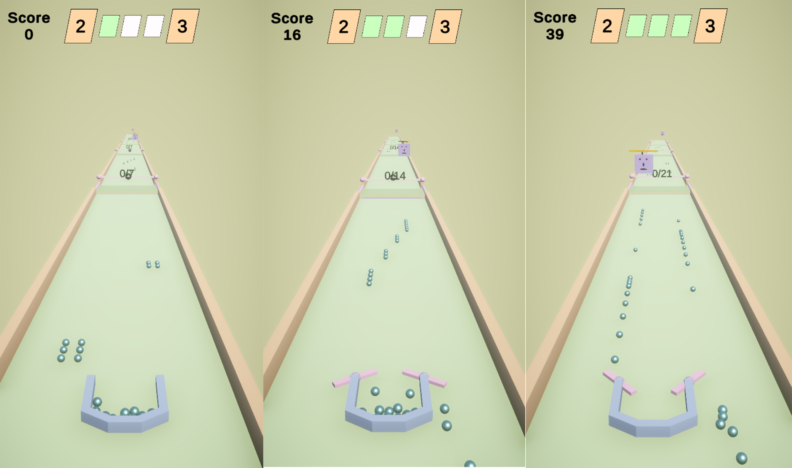</a>

 <h2>Game UI Screenshot</h2>
 
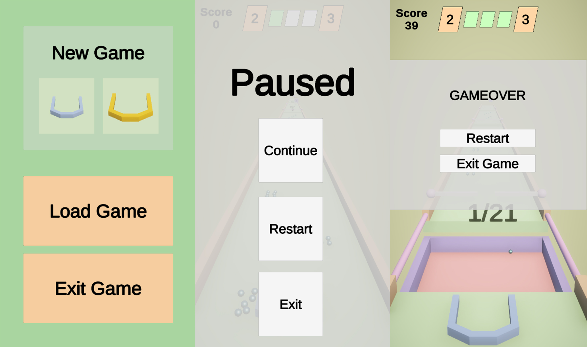</a>
 
 

---
---

 

## :bulb: Universal Render Pipline

 

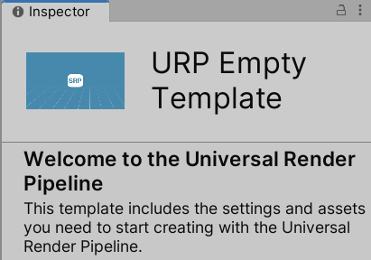</a>

 

I created the project using the Universal Render Pipeline template.

 

## :video_game: New Input System

 

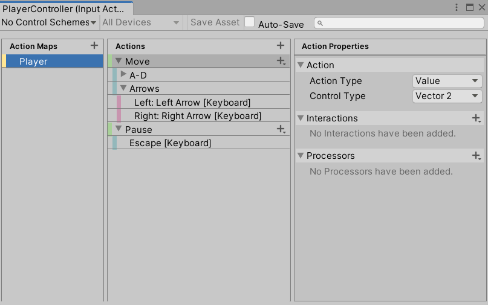</a>

I used the new input system in the project. I just created one Action Map. The Actins in the game are Move and Pause. You can move the character using both the A and D keys and the direction arrows. You can also pause the game by pressing the ESC key.

 

## :movie_camera: Cinemachine

 

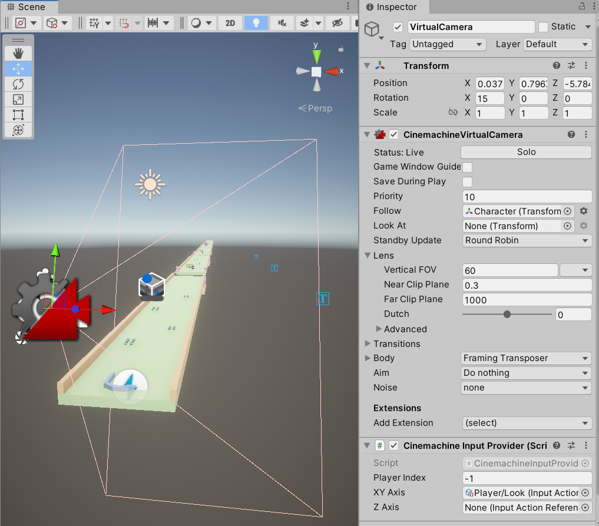</a>

 

I used virtual camera in game.

 

## :running: DOTween (HOTween v2)

 

</a>

 

I used Dotween to manage animations in the game with code. This is how I managed the movements of the Helicopter and the Platform (the new platform that comes over the pit when you level up).

 

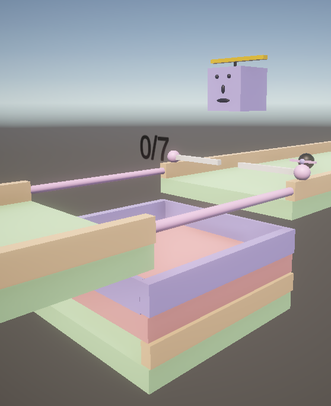</a>

 

## :floppy_disk: Save System via PlayerPrefs

 

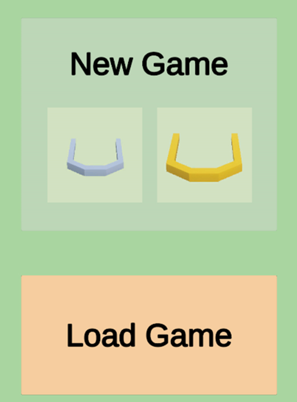</a>

 

I used the PlayerPrefs method to save the game. When you exit the game or start again, you will continue from the level you left, but your score information will be reset. You can change it in your own way if you want.

 

## :computer: Scriptable Objects

 

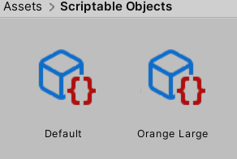</a>

 
When you log in to the game, you will see the character selection screen. I just sorted out the character variations by size and color. I used Scriptable Objects while doing this. You can create and add as many objects as you want from the Scriptable Objects array I created in the Inspector window.
 

 

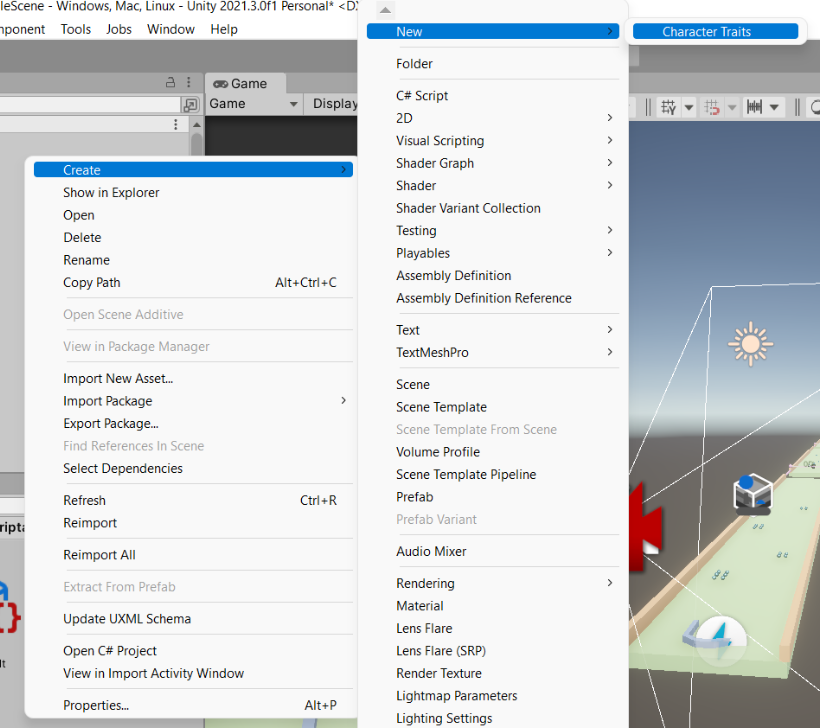</a>

 

## :8ball: Object Pooling

 

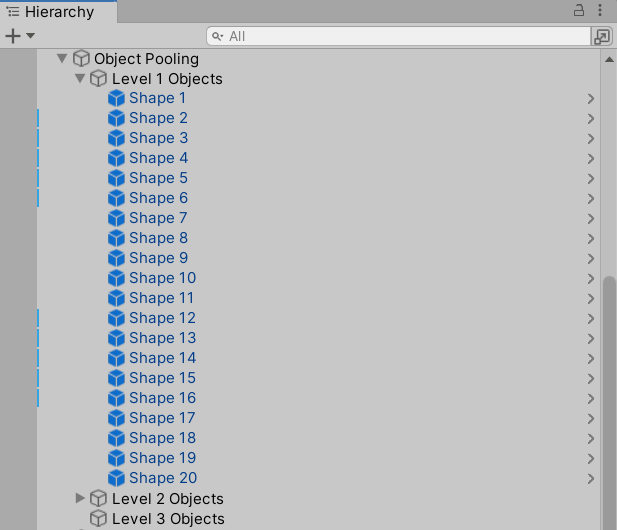</a>

 

After completing the first 3 levels in the game, you go back to the beginning, but you continue to play as if the next level has come. When you go back to the beginning, instead of creating new objects, we deactivate and reactivate after using the old ones. This also benefits us in terms of performance. So I used Object Pooling.

 

